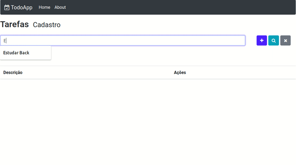

# React
Repositório para Projetos Básicos e Provas de Conceitos. [PoCs]!

# Projetos Básicos -> 
- Conceitos Testados:

# Todo App:

- ``
module.exports = mongoose.connect('mongodb://localhost/todo-app', 
{ useNewUrlParser: true, useUnifiedTopology: true, }) 
``
- ``
const todoSchema = new mongoose.Schema({
  description: { 
    type: String,
    required: true,
  },
  done: {
    type: Boolean,
    required: true,
    default: false,
  },
  createdAt: {
    type: Date,
    default: Date.now,
  },
})
``

# Calculadora:

# Fundamentos do React:

